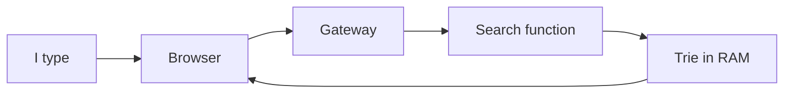
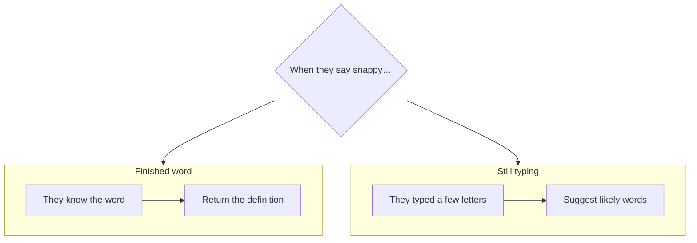

# My notes: dictionary search interview

For future me, when this all feels fuzzy again.

---

## Where I stand

I’m decent at **building** the system. Mid-level board talk is the weak part — not because I don’t know a trie, but because I didn’t **separate the problems** out loud early enough.

If I remember only one sentence:

> Looking up a finished word and suggesting completions while someone types are different problems. Ask which one “snappy” means before designing.

---

## What I actually made (and why that’s fine)

I loaded ~half a million words, built a prefix trie once at startup, and served typeahead from memory. For the load we estimated (~tens to a couple hundred reads/sec), that is plenty. I didn’t need Redis, 26 tables, or multi-region for this prompt.

Gut check: **the structure matches the interesting part of the problem.** The interview friction wasn’t “wrong tech.”

---

## The gap I keep underestimating

In the room I treated “search” as one blurry thing. The interviewer later said, almost literally: make this **two** conversations.

**Finished word** is easy: find the key, return the value. Index, hash map, trie leaf — whatever. Boring on purpose.

**Still typing** is where you earn the hour: prefix walk, how many suggestions, in what order, what happens when the spelling is wrong.

In this repo I mostly built the typing path, but I exposed it as one `/search`. So if I open the code tomorrow, it’s easy to forget I never practiced *saying* the easy path exists and is separate.

Intuition to keep: when a prompt says “search,” pause and ask whether they mean **retrieve** or **complete**.

---

## Where I got tangled (cache talk)

I reached for “we’ll cache things” without being crisp. They asked: **what are the keys and values?**

What I wish I’d said:

- For this size, the web process can **hold the dictionary structure in memory**.
- That *is* the hot path. I’m not caching random DB rows keyed by letter A.
- Redis only comes in if I have **many** machines that need the same shared hot data.

Intuition: “cache” isn’t a free point. If I can’t draw key → value on the board in 10 seconds, I’m waving my hands.

---

## The numbers thing

I did the subscriber math well (~20 whole-word lookups/sec). When autocomplete showed up, each “search” becomes many keystrokes. Roughly 10× → ~200/sec. Still fine for one service. I just didn’t re-say the number out loud when the product grew.

Intuition: every time the UX gets chatty with the server, **redo the estimate**.

---

## Stuff I floated that I’d skip next time

Partitioning the DB by first letter felt clever. It’s mostly a clumsy version of “the index already narrows you down.” Dataset fits in RAM / fits on a CD-ROM in the story — don’t invent 26 shards.

---

## Gaps, in language I feel

**I get it, I just have to say it earlier**
- Exact vs prefix (two boxes)
- Trie as the prefix structure
- Memory for hot data, not a vague Memcache story
- Revisit RPS when typeahead lands

**I understand the idea, haven’t practiced the tradeoff**
- Suggestions should prefer popular words, not A–Z. That means counting searches somehow, and not wrecking the read path with constant writes.
- “Did you mean rock?” for typos — OK to defer, but I should leave a door (“on miss, try nearby spellings”) so I don’t pretend the design forbids it.

**Not the point of this interview**
- CDN around the Anglosphere, full product auth, fancy multi-sense encyclopedia modeling. Mention if asked; don’t lead with them.

---

## Honest self-score (so the praise doesn’t erase the lesson)

| What I notice about myself | Rough feel |
|---|---|
| Sizing the problem / not overbuilding | Strong |
| Picking a trie / building it | Strong |
| Naming two problems early on the board | Weak — main lesson |
| Explaining cache without fluff | Medium — got pressed |
| Ranking / misspell as real product stories | Thin |

Builder mid+. Whiteboard mid / needs coaching on framing.

---

## 60 seconds before the next one

1. Ask what “snappy” means.  
2. Draw two boxes: finished word vs still typing.  
3. Say trie (or “Postgres can prefix-search; trie if we need it in process”).  
4. If I say cache, define key and value — or say “in-process structure, no Redis yet.”  
5. If they add typeahead, update RPS.  
6. Popularity and typos: short future paths, not designs that fight the trie.

That’s enough. The code in this repo is proof I can implement the interesting half — the next win is making the board match that clarity.
