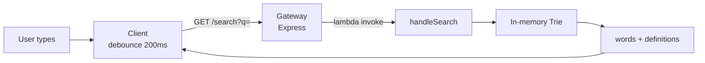
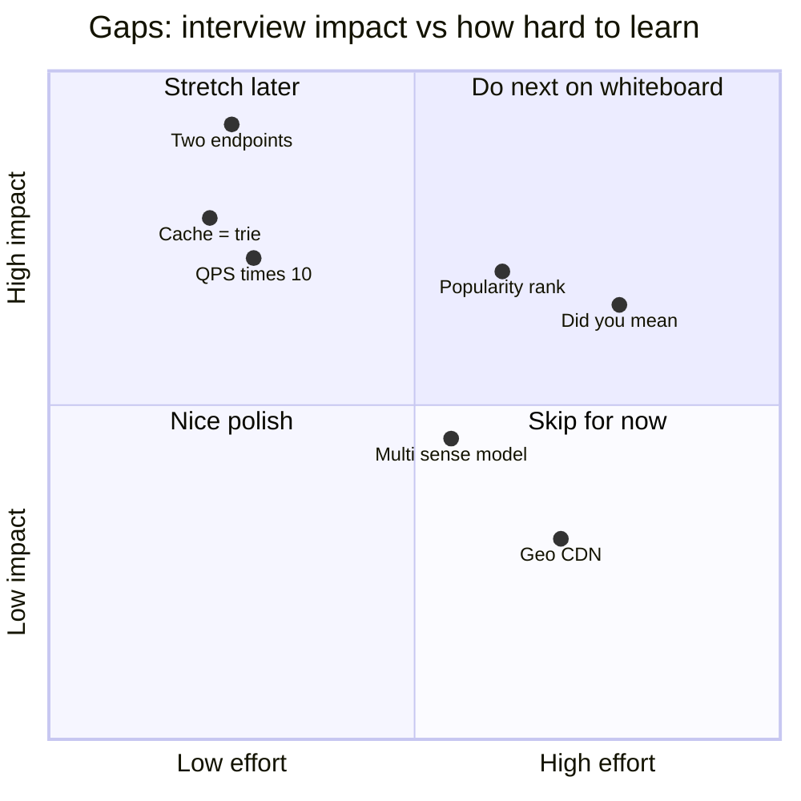
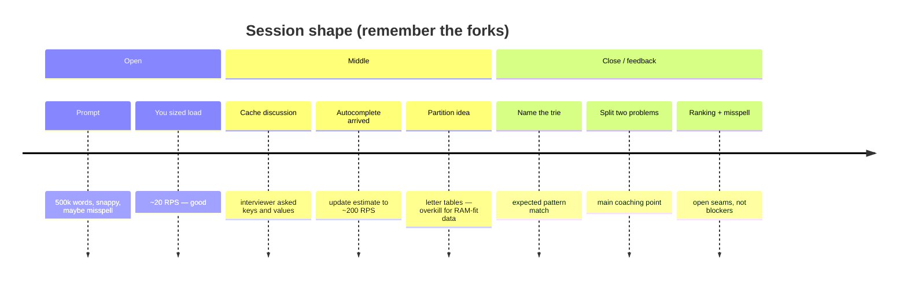

# Interview retrospective — dictionary search

One-page memory aid. Built for recall, not implementation.

**Overall:** mid-level ~~pass with coaching~~ · code MVP strong · whiteboard framing mid−  
**Biggest win:** in-memory **prefix trie** (right structure)  
**Biggest miss:** didn’t split **exact word GET** vs **prefix autocomplete** early

---

## 1. What you built (remember this shape)



Cold start: load ~467k words → build trie once → serve from RAM.  
Right size for interview load (~20 RPS exact → ~200 RPS with keystrokes).

---

## 2. The split the interviewer wanted (draw this next time)

```mermaid
flowchart TB
  subgraph easy ["Easy — exact lookup"]
    A1[User finishes a word] --> A2["GET /definitions/:word"]
    A2 --> A3[Hash / DB index / trie leaf]
    A3 --> A4[One entry + definition(s)]
  end

  subgraph hard ["Interesting — autocomplete"]
    B1[User typing] --> B2["GET /search?q=prefix"]
    B2 --> B3[Prefix walk + top-N]
    B3 --> B4[Ranked completions]
  end

  Q{What does snappy mean?} --> easy
  Q --> hard
```

**Talk track:** “Exact get is CRUD. Autocomplete is the design problem. Which do you care about?”

You shipped mostly the **hard** box, but as one `/search`, so the story stayed muddy.

---

## 3. Gaps map (what to practice)



If the chart doesn’t render, use this table:

| Gap | Impact | Effort | One-liner |
|---|---|---|---|
| Exact vs prefix endpoints | **Critical** | Low | Name two APIs in minute 5 |
| “Cache” = process-local trie | High | Low | Keys/values or say “no Redis yet” |
| Refresh QPS for keystrokes | High | Low | 20 × ~10 ≈ 200 RPS |
| Popularity ranking | High | Med | Count searches; rank ≠ alpha |
| Misspell / did you mean | Med–High | High | Seam on exact miss |
| Multi-definition / forms | Med | Med | Word → senses[] |
| Letter-table sharding | — | — | Avoid; interviewer called it clumsy |
| Multi-region CDN | Low for mid | High | Mention, don’t boil the ocean |

---

## 4. How the interview went (flow)



---

## 5. Mid-level scorecard (pre — today’s baseline)

| Dimension | Score | Sticky note |
|---|---|---|
| Problem sizing | 9/10 | Didn’t overbuild for RPS |
| Data structure | 9/10 | Trie in the repo; name it earlier live |
| Two-problem split | 4/10 | Main gap |
| Cache clarity | 5/10 | Implementation right; talk wasn’t |
| QPS after autocomplete | 7/10 | Base ok; ×10 late |
| Ranking | 3/10 | Alpha only |
| Misspell path | 3/10 | Deferred, no seam |
| Avoid complexity | 6/10 | Code ok; interview floated partitions |

**Band:** mid / mid− for whiteboard · mid+ for builder’s MVP

---

## 6. Cheat card (60 seconds before next interview)

1. Clarify **snappy** = low-latency exact **or** typeahead?  
2. Draw **two boxes**: exact GET vs prefix search.  
3. Say **trie** (or Postgres prefix index first, trie if needed).  
4. Cache: **“hot path is in-memory; Redis only if multi-instance.”**  
5. Recalculate RPS when autocomplete lands.  
6. Ranking: popularity side-channel, not hot UPDATEs.  
7. Misspell: “v2 on exact miss — don’t redesign storage.”

---

*Cut short of the follow-up feature plan. This file is the takeaway.*
